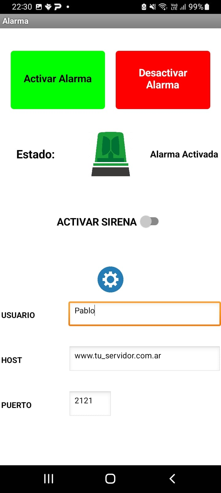

<h1 align="center">Sistema de Alarma IoT + Servidor Python</h1>

El sistema combina un servidor remoto a una alarma con conexión Wifi, que se conecta a diferentes periféricos de entrada (sensores de mivimiento, barreras infrarrojas, sensores magneticos, etc) y actúa según los parámetros de programacón para dar aviso, activar y desactivar, etc.

  

## Acerca del Proyecto

El código implementa un servidor de sockets en Python que se encarga de controlar el estado de una alarma en una placa y permite a una aplicación Android activar o desactivar la alarma. También permite a la placa enviar un mensaje de alarma a la aplicación Android.

El servidor está configurado para escuchar en el puerto 2121 y acepta conexiones entrantes. Luego, recibe y procesa los datos enviados por la placa y la aplicación Android.

El código utiliza la biblioteca estándar de Python socket para crear el socket y establecer la conexión. También utiliza la biblioteca os para verificar si existe el archivo est.txt y leer su contenido.

La variable estado_alarma se utiliza para almacenar el estado actual de la alarma. Si el archivo est.txt existe, su valor se lee y se asigna a la variable. Si el archivo no existe, la variable se inicializa en False.

La variable sonar_sirena se utiliza para indicar si la sirena debe sonar o no.

La variable alarma_automatico se utiliza para indicar si la alarma se disparó automáticamente.

La variable msj_enviado se utiliza para indicar si se envió un mensaje de alarma a la aplicación Android.

La variable vueltas se utiliza para almacenar el número de vueltas que se deben dar antes de enviar un mensaje de alarma a la aplicación Android.

La variable contador se utiliza para contar el número de vueltas que quedan antes de enviar un mensaje de alarma a la aplicación Android.

El bucle principal del servidor acepta conexiones entrantes y recibe y procesa los datos enviados por la placa y la aplicación Android. Si el servidor no recibe ningún dato durante 30 segundos, cierra la conexión.

El servidor cierra todas las conexiones abiertas cuando detecta que no se reciben datos. También cierra todas las conexiones cuando recibe el comando cerrar.

El servidor implementa los siguientes comandos:

* dispara=SI: dispara la alarma automáticamente.
* estado2: devuelve el estado de la alarma y de la sirena.
* activarA: activa la alarma desde la aplicación Android.
* desactivarA: desactiva la alarma desde la aplicación Android

  

